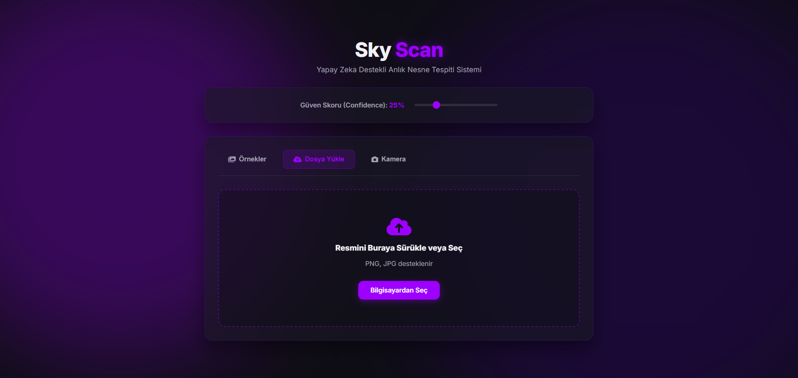
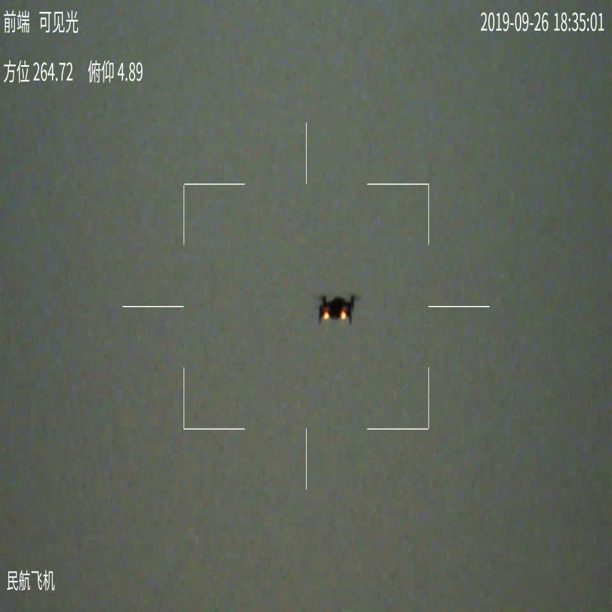
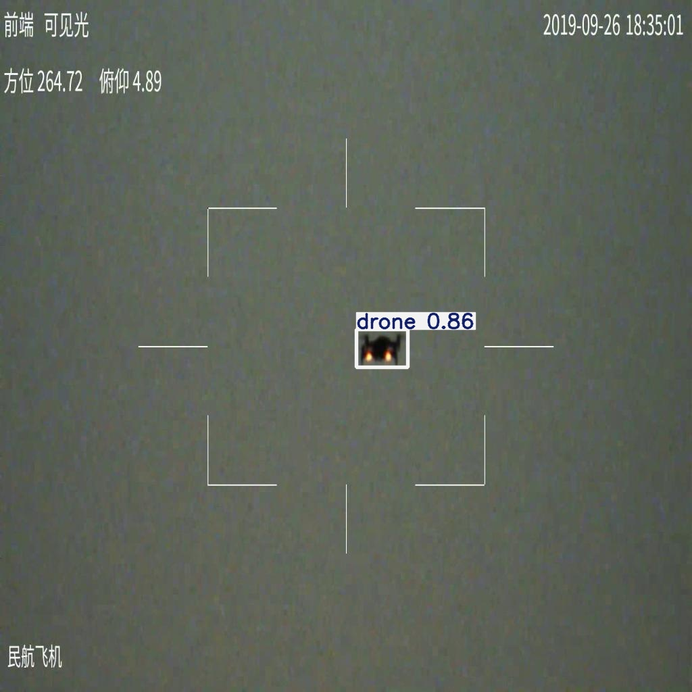

<div align="center">

# 🛰️ SkyScan

**Hava Kökenli Nesneleri Tespit Eden YOLOv8 Tabanlı Web Uygulaması**

[](https://python.org)
[](https://flask.palletsprojects.com)
[](https://ultralytics.com)
[](LICENSE)

[Özellikler](#-özellikler) · [Kurulum](#-kurulum) · [Kullanım](#-kullanım) · [Proje Yapısı](#-proje-yapısı) · [Dataset](#-dataset)

</div>

---

## 📖 Hakkında

**SkyScan**, hava kökenli nesneleri (drone, uçak, helikopter vb.) tespit etmek amacıyla geliştirilmiş, YOLOv8 modeli üzerine inşa edilmiş bir Flask web uygulamasıdır. Radar kamerası görüntülerinden tutun sıradan fotoğraflara kadar geniş bir yelpazede çalışabilen model; kullanıcılara güven eşiğini anlık ayarlama, yerel görüntü yükleme ve örnek galeri üzerinden hızlı test imkânı sunar.

---

## ✨ Özellikler

- 🔍 **Yüksek Doğruluklu Tespit** — YOLOv8 ile hızlı ve güvenilir nesne tespiti
- 📤 **Görüntü Yükleme** — PNG/JPG dosyalarını sürükle-bırak ya da dosya seçici ile yükle
- 🖼️ **Örnek Galeri** — Sunucudaki hazır görüntülerle tek tıkla test
- 📷 **Kamera Desteği** — Doğrudan kamera beslemesinden anlık analiz
- 🎚️ **Dinamik Güven Eşiği** — Arayüzdeki kaydırıcıyla hassasiyeti anlık değiştir
- 🌑 **Karanlık Tema** — Göz yormayan, modern mor/siyah arayüz

---

## 🖼️ Uygulama Görünümleri

### Arayüz

<p align="center">
  
</p>

> Dosya Yükle, Örnekler ve Kamera sekmeleri; üstte ayarlanabilir Güven Skoru kaydırıcısı.

---

### Tespit Örneği — Drone

<p align="center">
  
  
</p>

> **Sol:** Radar kamerası ham görüntüsü. **Sağ:** YOLOv8 tarafından `drone` olarak etiketlenmiş ve `0.86` güven skoru atanmış sonuç.

---

## 🛠️ Teknoloji Yığını

| Katman | Teknoloji |
|--------|-----------|
| Backend | Python, Flask |
| Yapay Zeka | YOLOv8 (Ultralytics) |
| Görüntü İşleme | OpenCV, NumPy |
| Frontend | HTML5, CSS3, JavaScript |

---

## 📦 Kurulum

### Gereksinimler

- Python 3.8+
- pip

### Adımlar

```bash
# 1. Depoyu klonlayın
git clone https://github.com/MertAlii/SkyScan.git
cd SkyScan

# 2. Bağımlılıkları yükleyin
pip install -r requirements.txt

# 3. Uygulamayı başlatın
python app.py
```

Tarayıcınızda `http://127.0.0.1:5000` adresini açarak uygulamayı kullanabilirsiniz.

---

## 🚀 Kullanım

1. **Görüntü Seç** — "Dosya Yükle" sekmesinden yerel bir PNG/JPG yükleyin, "Örnekler" sekmesinden hazır bir görüntü seçin ya da "Kamera" sekmesini kullanın.
2. **Eşiği Ayarla** — Sayfanın üstündeki **Güven Skoru** kaydırıcısını istediğiniz hassasiyete getirin.
3. **Sonuçları İncele** — Tespit edilen nesneler, sınıf adı ve güven skoru ile birlikte bounding box olarak görüntülenir.

---

## 📁 Proje Yapısı

```
SkyScan/
├── app.py                   # Flask uygulama giriş noktası
├── requirements.txt         # Python bağımlılıkları
├── models/
│   └── best.pt              # Eğitilmiş YOLOv8 model ağırlıkları
├── data/
│   └── images/              # Galeri için örnek görüntüler
├── static/
│   ├── css/                 # Stil dosyaları
│   └── js/                  # İstemci tarafı mantık
├── templates/
│   └── index.html           # Ana arayüz şablonu
└── assets/
    └── screenshots/         # README görselleri
```

---

## 📊 Dataset

Model, **Roboflow Universe** üzerinde yayımlanmış olan **air-borne-objects** (versiyon 6) veri setiyle eğitilmiştir. Veri seti drone, uçak ve helikopter gibi hava kökenli nesnelere ait radar ve görünür ışık kamera görüntülerinden oluşmaktadır. Söz konusu veri seti şu anda herkese açık erişime kapatılmış olsa da çalışmaya katkısı nedeniyle atıfta bulunulmaktadır.

> *air-borne-objects, v6* — Roboflow Universe.  
> Erişim tarihi: 2024. [https://universe.roboflow.com](https://universe.roboflow.com)

---

## 📄 Lisans

Bu proje [MIT Lisansı](LICENSE) kapsamında dağıtılmaktadır.